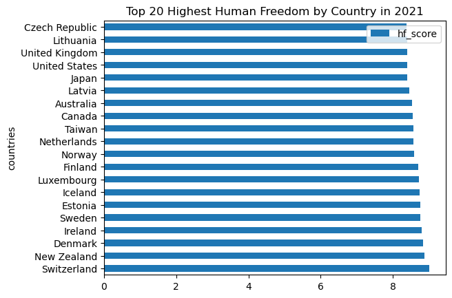
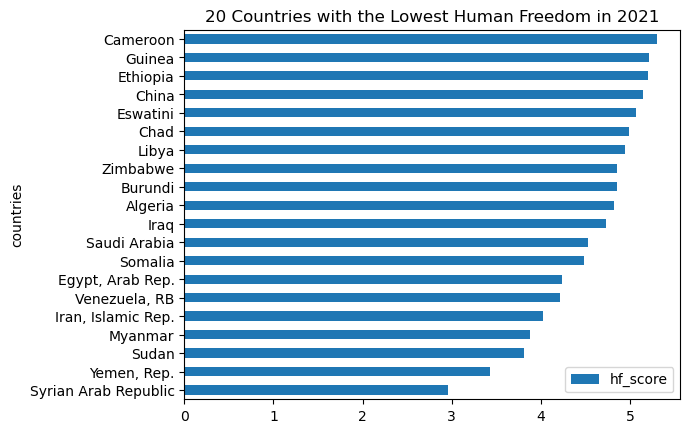
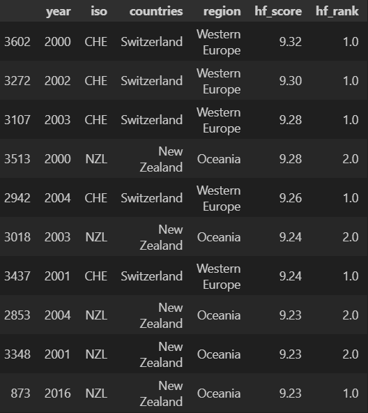
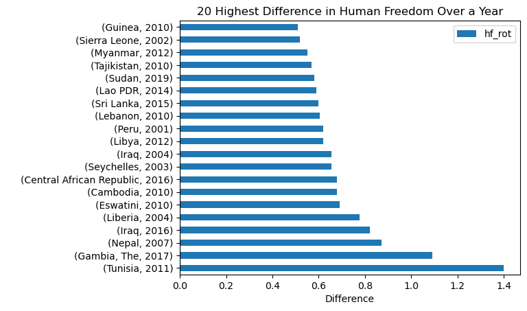
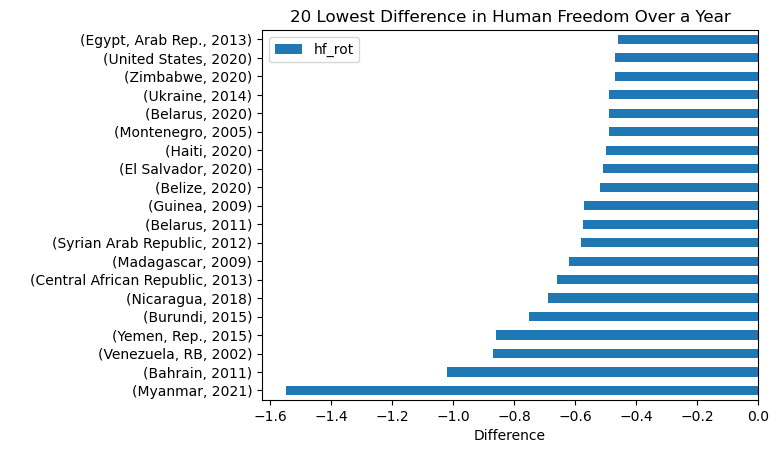
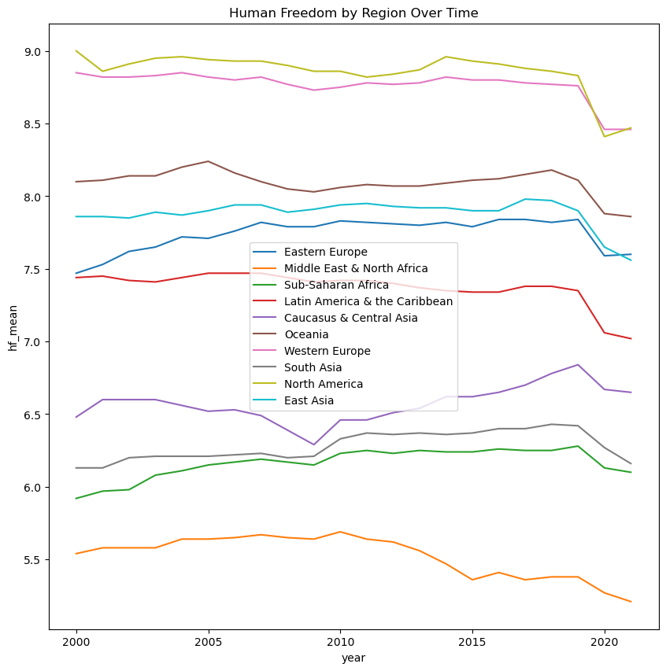
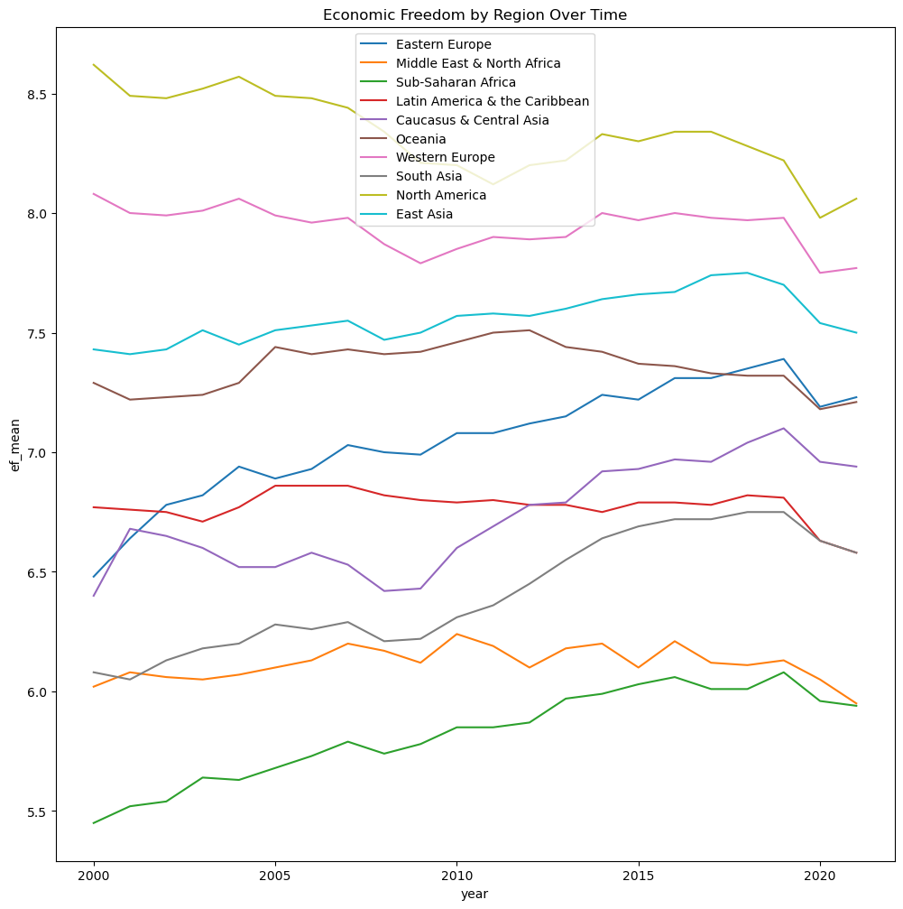
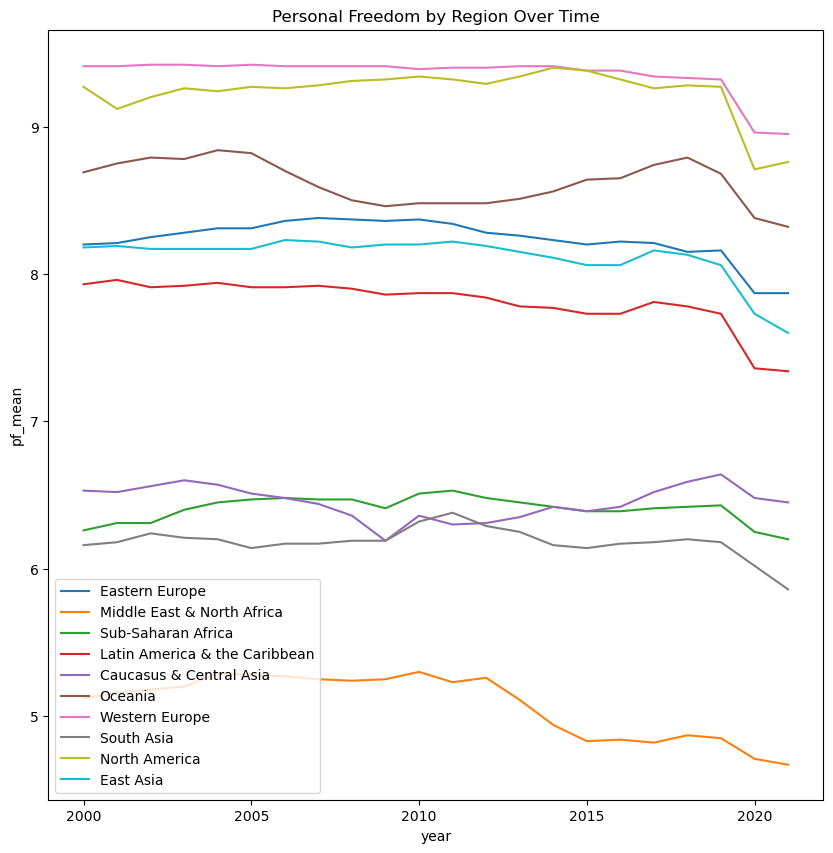
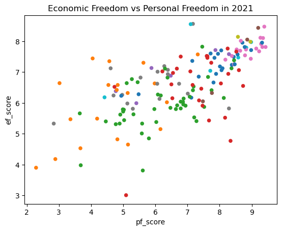
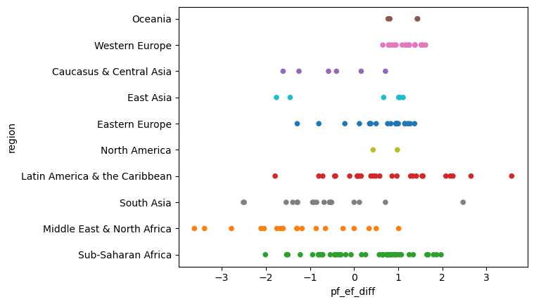

# Human-Freedom-Index-Python

## Introduction
Investigate the Human Freedom Index 2023 data from the CATO Institute. All of the data cleaning, analysis, and plotting was done using Python.
[Data Cleaning](data_clean.py), [Data Analysis](eda.py)

## Background
Using my background in econometrics, I wished to explore economic and human indicators from countries and regions around the world. This gave me a great opportunity to use and improve my skills of python.

Data is from [CATO Institiute](https://www.cato.org/human-freedom-index/2023)

## Questions About the Data
1. Which countries have the highest human freedom in 2021? What about of all time? How does this compare over time?
2. Which regions have the highest human freedom, personal freedom, and economic freedom?
3. Are there countries that have a significantly higher personal freedom than economic freedom? What about the other way?

# Tools I Used

- **Python:** The entire project was done using the programming language Python.

- **Pandas:** The main Python module that I used for cleaning and exploring the data.

- **Matplotlib & Seaborn:** Both of these modules were used to create plots of the analysis.

- **Git & GitHub:** Allow me to share all of the code online.

# The Cleaning
While the data from the CATO Institute is already cleaned and in a uniform format, there were still many missing values that would cause my analysis to be off. These missing values were located both on the indicators side as well as the scores side. Meaning that 350 rows of data spanning from 2000 to 2021 would be unhelpful.

### Cleaning Process
To calculate the Human Freedom score, take the average of the Personal Freedom score and the Economic Freedom Score. The Personal Freedom and Economic Freedom scores were calculated by taking the average of all the indicators in that field. 

The only problem was that there were NULL values spread through all of the indicators for various countries over various years. The best method to fill in these NULL values would be to take the mean of that indicator for that particular country.

Created a function to fill in the mean for all of the NULL Economic indicators:
```python
def fill_na(ef_df_f, group_countries, var_col):
    for col in var_col:
        country_mean=ef_df_f.groupby(group_countries)[col].transform('mean')
        ef_df_f[col]=ef_df_f[col].fillna(country_mean)
    return ef_df_f

columns=['ef_government','ef_legal','ef_money','ef_trade','ef_regulation']
ef_df_f=fill_na(ef_df_f, 'countries', columns)
```

Only one Personal Freedom indicator had NULL values, so used one line to fill with means:
```python
country_mean_pf=pf_df_f.groupby('countries')['pf_identity'].transform('mean')
pf_df_f['pf_identity']=pf_df_f['pf_identity'].fillna(country_mean_pf)
```
#### Calculating Human Freedom
Now that all of the indicators for both Economic and Personal Freedom are filled in, we can calculate the scores for Human, Personal, and Economic Freedom.


Using loc to gather all of the indicators and then filling the NULLs in score with the mean:
```python
#Fill in ef_score
mean_ef=ef_df_f.loc[:,['ef_government','ef_legal','ef_money','ef_trade','ef_regulation']].mean(axis=1)
ef_df_f['ef_score']=ef_df_f['ef_score'].fillna(mean_ef)
ef_df_f['ef_score']=round(ef_df_f['ef_score'],2)
ef_df_f

#Same Process for pf_score
mean_pf=pf_df_f.loc[:,['pf_rol','pf_ss','pf_movement','pf_religion','pf_assembly','pf_expression','pf_identity']].mean(axis=1)
pf_df_f['pf_score']=pf_df_f['pf_score'].fillna(mean_pf)
pf_df_f['pf_score']=round(pf_df_f['pf_score'],2)
pf_df_f

#Add the dataframes containing ef to the dataframe containing pf
sum_hf=ef_df_f['ef_score'].add(pf_df_f['pf_score'])
mean_hf=sum_hf/2
hf_df['hf_score']=hf_df['hf_score'].fillna(mean_hf)
hf_df
```

# The Analysis
Here is my approach to investigating the questions I set out answer:

## 1. Highest Human Freedom
### Human Freedom 2021
To find out which countries have the highest and lowest Human Freedom scores in 2021(the latest year in the dataset) I created bar charts to display the results





Breakdown of the results:

- **Top 20:**

The country with the highest hf score is Switzerland with 9.01, followed by New Zealand with 8.88. Out of the top 20 countries, 50% of them are from Western Europe. Looking closer at the top 10 we can see that they also all rank in top 10 of Personal Freedom, but only the top 4 are located in the top 10 of Economic Freedom.

- **Bottom 20:**

The country with the lowest Human Freedom score is the Syrian Arab Republic with a score of 2.96. There is a clear correlation between countries that reside in the regions of Middle East and Africa, and having a low Human Freedom score. An intersting point is that China comes in at the 17th lowest spot despite it having the second largest economy by GDP.

### Human Freedom All Time
If we look at the top 10 highest scoring countries from 2000-2021, the list is dominated by Switzerland and New Zealand. The highest score is Switzerland from 2000 at 9.32.



### Year Over Year
As data has been added every year from 2000 until 2021, it should be particularly insightful to see how much the hf scores change from year to year. To find the difference between years, pandas has diff(). However, this takes the latest year and subtracts by the year before. This is opposite to what we want, so we must first invert the axis, take the difference, and then invert it again.
```python
hf_diff=hf_df.iloc[::-1]
hf_diff['hf_rot']=hf_diff.groupby('countries').hf_score.diff()
hf_diff=hf_diff.iloc[::-1]
hf_diff=hf_diff[hf_diff['hf_rot'].notna()]
```
Breakdown of results:

- **Upward Changes:**

The country with the biggest change in hf was Tunisia in 2011, improving by 1.4 up to 6.43. The only other instance of an increase greater than 1 was with Gambia in 2017 with an increase of 1.09 up to 6.59. All but one of the 20 biggest jumps were with countries that started with a hf score of less than 7, which makes sense. As countries that are lower on the Human Freedom score have more room to grow upwards as opposed to those that are already high.



- **Downward Changes:**

On the opposite side of the spectrum, Myanmar from 2021 has the biggest negative change, going down 1.55 to 3.88. A very interesting finding in this chart is that the United States has the 19th largest drop in hf in 2020, dropping by 0.47. Actually, six of the top 20 largest drops were recorded in 2020, with another one coming in 2021. This is most likely a tangible effect of the Covid-19 pandemic and the subsequent lockdowns on Human Freedom.



## 2. Regions
To look at the mean score for each region, I created new dataframes that grouped by the region and year then got transformed by the mean. Now that we have those dataframes, I created a for loop that would plot each unique region by their mean score and label them correctly.
```python
plt.figure(figsize=(10,10))
for cat in region_hf_mean['region'].unique():
    sub=region_hf_mean[region_hf_mean['region']==cat]
    sns.lineplot(data=sub, x='year', y='region_hf_mean', label=f'{cat}')
plt.ylabel('hf_mean')
plt.title('Human Freedom by Region Over Time')
```

Breakdown of results:
- **Human Freedom by Region:**

The two regions that are clearly at the top are North America at 8.47 and Western Europe at 8.46. The bottom two are the Middle East & North Africa at 5.21 and Sub-Saharan Africa at 6.10. However, by looking at the graph it shows how large of a divide there is between the Middle East at the bottom and everybody else. All of the regions had sharp drops coming around 2020, likely coinciding with the pandemic. Interstingly, while other regions have either increased or held steady since 2010 the Middle East has been on a significant downward trend. The first arab spring that swept over the arab world started in late 2010, so it is possible that this is correlated.



- **Economic Freedom by Region:**

Once again the two highest scoring regions are North America and Western Europe at 8.06 and 7.77 respectively. Similarly, Sub-Saharan Africa at 5.94 and the Middle East & North Africa at 5.95 are at the bottom. Using the line charts ability to see fluctuations over time, we see that the top three regions of North America, Western Europe, and East Asia have held their rankings from 2000 to 2021 without changing. However, every other region has had some sort of ranking change, with the biggest riser being Eastern Europe going from 7th and ending at 4th, a rise of ~0.7 score. Another benefit of this line chart is seeing how each regions economic freedom was impacted by large economic events. In 2007-2008 the great recession affected North America and Western Europe immensely as we can see in the chart, but surprisingly there were many regions that had accelerated growth during this time such as Eastern Europe.



- **Personal Freedom by Region:**

The top two regions for personal freedom are unsurpisingly Western Europe at 8.95 and North America at 8.76. Oceania comes in third at 8.32 when it was just middle of the pack for economic freedom. Another common ranking is the Middle East & North Africa coming in last at 4.67, but Sub-Saharan Africa that was last or second to last in all the other scores comes in third to last here with 6.20. The line plot shows us three distinct groupings of regions. The top group includes North America, Western Europe, Oceania, Eastern Europe, East Asia, and Latin America & The Caribbean. The middle group includes the Caucaus & Central Asia, Sub-Saharan Africa, and South Asia. At the very bottom far from any other region is the Middle East & North Africa, whose steep downward trend following 2010 has been an anomoly. All regions did see a drop in personal freedom following 2020, with the highest ranking countries seeing the largest declines. 




# 3. Countries Differences
While most countries follow the trend of having a rouhgly 1:1 ratio of personal freedom to economic freedom, there are some that lean more heavily on one side than the other.



To calculate this, I created a dataframe that found the difference between the pf score and the ef score for each country in 2021. Having a positive difference indicates a higher personal freedom then economic freedom, and a negative difference indicates a higher economic freedom then personal freedom.
```python
ep_diff=df_2021
ep_diff['pf_ef_diff']=ep_diff['pf_score']-ep_diff['ef_score']
```



Breakdown of the results:

- **Higher Personal Freedom:**

The country with the largest pf to ef difference is Argentina with a difference of 3.57, followed by Suriname with a difference of 2.65. Argentina having the highest pf to ef difference is more impressive then surprising. With a personal freedom score of 8.34 it dwarfs its economic freedom score of 4.77 which makes sense as Argentina is known to have one of the worst economies in the world. Latin America and Sub-Saharan Africa dominate this list as they fill 9 of the top 10 spots. This is due in part to both having strong personal freedoms while simultaniously having very weak economies.

- **Higher Economic Freedom:**

The country with the largest ef to pf difference is Saudi Arabi with a difference of 3.62, followed by Bahrain with 3.39. This makes perfect sense for Saudi Arabia and other Middle East & North Afrcan countries(which take up half of the top 10) as they are know for being inceredibly oil rich but not for the freedoms they give to their citizens. Similarly, China being at number 10 is unsurprising as they have the 2nd largest economy in the world but are very vocal about the numerous authoritarian policies they have over the country.

- **Scatter Insights:** 

To fall within the top 10 for either ranking, the country should have a difference of about 1.7 or greater. The scatter plot very clearly shows that the Middle East & North Africa and Latin America & the Caribbean follow very different trends with the former having a skew towards greater economic freedom, and the latter skewing towards greater personal freedom. The region with the least amount of variability is clearly Western Europe, all which reside from about 0.2 to 1.6. There isn't anything concrete in this data that explains this but it is likely due to the power and stability of the European Union.

# What I Learned
By cleaning, exploring, and plotting this data I was able to greatly improve my data analysis skills using Python.

- **Filtering:**

I went from being very confused and frustrated over the way data is filtered in pandas, as it is much more complicated than using SQL, to understanding the process and enjoying the greater reach this tool provides.

- **Functions and Loops:**

Before working on this project I found it very difficult to decide when to implement functions and loops and even more difficult to actually create them. I definetly struggled mightly on those sections in this project, but going through that has helped me become a better coder and thinker. 

- **Graphing:**

Using matplotlib and seaborn in tandem was a great way for me to see the benefits and drawbacks that each one of them posesses. It now allows me to know when to utilize each one in order to reach the best possible result.

- **Real World Data:**

The data I used in the project is most certainly real world data, as it comes from a well respected institue and is referenced countless times. This gave me a better scope to what data anlysis can be used for. It also showed to me that data can be cleaned and manipulated further in a way that benefits your analysis.

# Conclusion
## Insights

- **Western Dominance:**

The "Western World" dominated in almost all of these categoreis. With North America and Western Europe alone at the top of Human Freedom score, Personal Freedom Score, and Economic Freedom score. While North America's consistent high scores can in part be attributed to it conisisting of only two counrties(The United States and Canada), Western Europe consists of nearly as many countries as any other region.

- **The Middle East & Africa:**

Situated at the bottom of almost all metrics are the countries of the Middle East and Africa. This is a very unfortuante but not surprising result as these regions were subjugated to many long years of outside powers exploiting their resources and labor, and now being known for political instability and human rights abuses.

## Closing Thoughts
I feel much more confident about my skills and abilities when it comes to Python. Going forward, this allows to me to effectively leverage multiple skills and programs in my data analysis journey.
